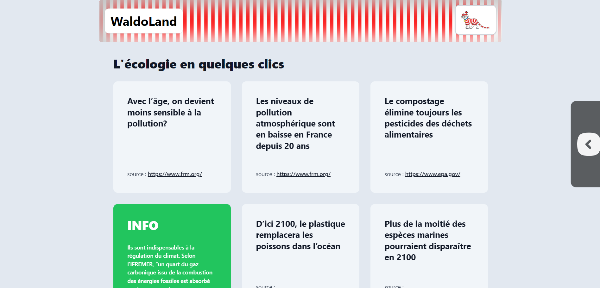
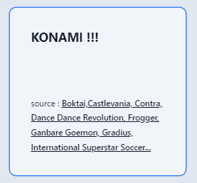
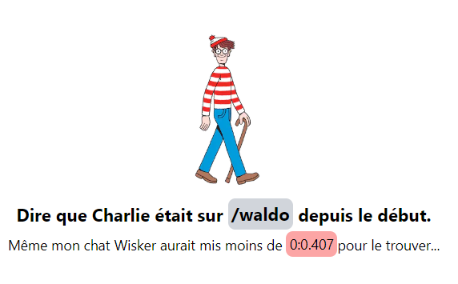
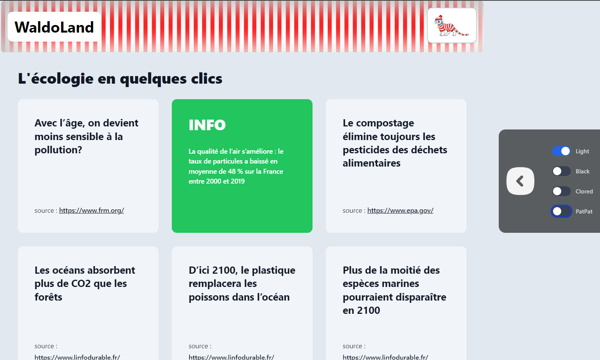
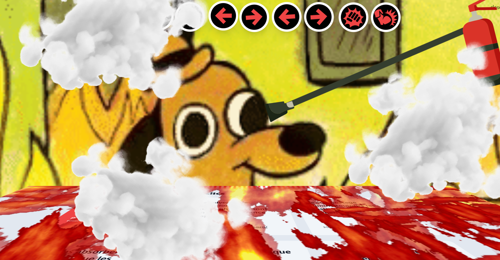
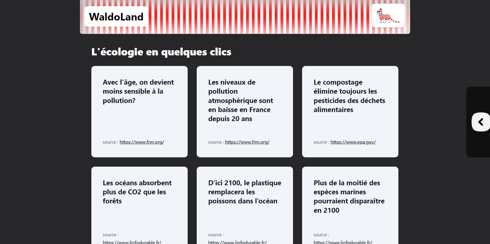
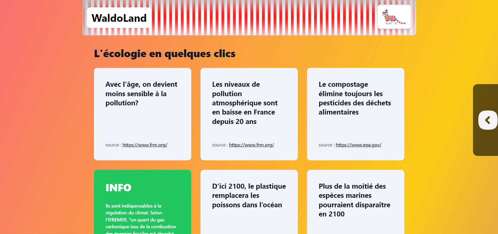

<h1 align="center">Pat the Waldo</h1>
<h4 align="center">Cody ADAM - Mael KERICHARD - Thomas DELAPART</h4>
<p align="center">
   
   
</p>



# Défis
- [A la conquête de "l’œuf de pâques"](https://www.nuitdelinfo.com/inscription/defis/302)
- [This is better than Hadouken !](https://www.nuitdelinfo.com/inscription/defis/332)
- [SVG sous hormones !](https://www.nuitdelinfo.com/inscription/defis/391)
- [Jeu Thèmes !](https://www.nuitdelinfo.com/inscription/defis/392)
- [Où est Charlie ?](https://www.nuitdelinfo.com/inscription/defis/393)

# Installation

Le projet est disponible sur [nuit-de-linfo-2023.vercel.app](https://nuit-de-linfo-2023.vercel.app/).

Pour lancer le projet en local, il faut installer les dépendances avec `npm install` puis lancer le serveur avec `npm run dev`.

# Projet principal

Ce site s'appellant `Pat the Waldo` est un site qui permet de vérifier ses connaissances sur l'écologie à travers un système de carte de Quizz. Nous avons ainsi à notre disposition une liste de 27 cartes.

Pour chaque carte, il y a une question étant vraie, fausse ou les deux. Il faut essayer de trouver la bonne réponse et de cliquer sur la carte pour voir si la réponse est bonne ou non. 

Les questions des cartes sont tirées de site fiables permettant d'apprendre en toute confiance.

Toutefois, sur ce site ils y a aussi une multitude de fonctionnalités plus ou moins cachées que vous pouvez découvrir en parcourant le site. Une description complète de ces fonctionnalités est disponible dans la section [Fonctionnalités](#fonctionnalités).

# Fonctionnalités

## Où est Charlie ?

- Il suffit de cliquer sur le bouton qui contient le chien de Charlie pour lancer le quête pour trouver Charlie.
- Une fois que le bouton est cliqué, commencez par trouver le bon mot de passe pour accéder à la page suivante.
- Puis cliquer sur le gros bouton rouge pour trouver Charlie.

## Easter eggs
### ⚠️ Attention Spoilers⚠️
**Nous vous recommandons de d'abord essayer de trouver les Easter eggs par vous-même avant de lire cette section.**
- PatPat : passez votre souris sur le chien de Charlie pour lui faire des papouilles.
<!-- gif assets/patpatdog.gif -->

- Carte Hadouken : cliquez sur la carte différente pour voir quel est le code konami.

- Triche Charlie : allez à l'URL `/waldo` pour accéder directement à la page de Charlie. 

- Hadouken : faites haut, haut, bas, bas, gauche, droite, gauche, droite, B, A, pour lancer un Hadouken.
  - Vidéo de démonstration :
https://youtu.be/pIdGyahzyAw
[](https://www.youtube.com/watch?v=pIdGyahzyAw)
- La palette de thèmes disponible dans le menu déroulant à droite de la page d'accueil.

  - Un thème light par défaut.
  - Un thème dark pour les yeux sensibles.
  - Un thème coloré pour plus de fun.
- Le mode patpat pour faire des papouilles à tout le monde.
[](https://nuit-de-linfo-2023.vercel.app/)
## Hadouken !
- Avec votre clavier, faites haut, haut, bas, bas, gauche, droite, gauche, droite, B, A, pour lancer un Hadouken.
- Une des cartes de la page d'accueil est différente des autres, elle vous rappelle le code Konami.
- Vidéo de démonstration :
https://youtu.be/pIdGyahzyAw
[](https://www.youtube.com/watch?v=pIdGyahzyAw)

## SVG sous hormones !
- Lancez un Hadouken pour faire apparaître un extincteur en SVG. Utilisez-le pour éteindre le feu. Vous pouvez même profiter de cette expérience avec du son.


## Jeu Thèmes !
- Plusieurs thèmes sont disponibles dans le menu déroulant à droite de la page d'accueil.
  - Un thème light par défaut.

  - Un thème dark pour les yeux sensibles.

  - Un thème coloré pour plus de fun.

  - Un mode patpat pour faire des papouilles à tout le monde.


# STRUCTURE & FILES
```
📁 NUIT-DE-LINFO-2023/
├── 📁 app/
│   ├── 📁 not-waldo/
│   │   └── 📄 page.tsx
│   ├── 📁 waldo/
│   │   └── 📄 page.tsx
│   ├── 📄 favicon.ico
│   ├── 📄 global.css
│   ├── 📄 layout.tsx
│   └── 📄 page.tsx
├── 📁 asets/
│   ├── 📄 gifs
│   └── 📄 pngs
├── 📁 components/
│   ├── 📁 games/
│   │   ├── 📄 button-and-cursor-game.tsx
│   │   └── 📄 password-game.tsx
│   ├── 📁 icons/
│   │   ├── 📄 ExtinguisherBody.tsx
│   │   ├── 📄 ExtinguisherNose.tsx
│   │   ├── 📄 GameIconsBootKick.tsx
│   │   ├── 📄 GameIconsPunchBlast.tsx
│   │   └── 📄 MdiArrowLeftThick.tsx
│   ├── 📄 Hadouken.tsx
│   ├── 📄 navbar.tsx
│   ├── 📄 pat-pat.tsx
│   ├── 📄 theme-content.tsx
│   └── 📄 waldo-button.tsx
├── 📁 lib/
│   └── 📄 formatTime.ts
├── 📁 public/
│   ├── 📄 SVGs
│   └── 📄 Audios
├── 📄 README.md
├── 📄 next.config.js
├── 📄 package-lock.json
├── 📄 package.json
├── 📄 postcss.config.js
├── 📄 tailwind.config.ts
└── 📄 tsconfig.json
```

# Auteurs

Nous sommes 3 étudiants de l'ESIR à Rennes en 5ème année de cycle ingénieur. Ce projet a été réalisé dans le cadre de la nuit de l'info 2023. Que vous soyez un étudiant, un professeur ou un membre du jury, nous vous souhaitons de passer un agréable moment sur notre site.